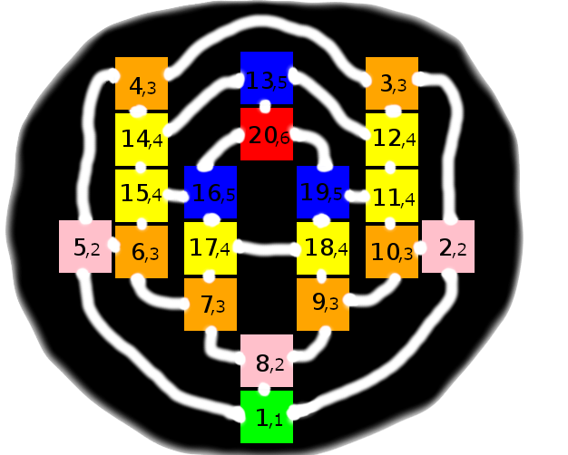

# Hunt The Wumpus

## 1. The Wumpus World Simulator

Edited, Compiled, Modified by:

Author: 

- Ruben Carlo Benante (rcb@beco.cc)

Copyright: 2012 - 2022

License: GNU GPL Version 2.0

Based on:

- Original by Gregory Yob (1972)
- Larry Holder (accessed version Oct/2005)
- Walter Nauber 09/02/2001
- An Anonymous version of Hunt The Wumpus with menus (aeric, 2012?)

Special thanks to:

- Larry Holder (holder@wsu.edu) (version 1.0 and version 2.3)
- Walter Nauber (walter.nauber@tu-dresden.de) (swi-prolog version)

A very special thanks to Gregory Yob (in memoriam) and beloved wife,
who was kind enough to answer my call and share with me a picture to upload 
to his wikipedia page:

https://en.wikipedia.org/wiki/Gregory_Yob

## 2. How to start the simulation

### 2.1. Let the agents play

To start an agent, on your shell, type (for example, agent 001):

```
$ swipl -s agente001.pl
```

Then it will give you a SWI-Prolog prompt `?-`, after the welcome message:

```
Welcome to SWI-Prolog (threaded, 64 bits, version 8.4.3)
SWI-Prolog comes with ABSOLUTELY NO WARRANTY. This is free software.
Please run ?- license. for legal details.

For online help and background, visit https://www.swi-prolog.org
For built-in help, use ?- help(Topic). or ?- apropos(Word).

?-
```

Now you simply type `start` and the agent will take over and run until it finishes either successfully or it dies for some reason.
The reasons for dying are:

- Starvation: you used all allowed actions for that board size
- Hunted by the Wumpus: you got eaten by a beast
- Fell in a pit: you steped in an endless abyss

Lets see the two first actions of agent 001:

```
?- start.
Trial 1
User defined setup: Size=5, Type=grid, Move=walker, Gold=0.2, Pit=0.1, Bat=0.1, Adv=[no,no]
External init_agent...
-------------------------------
|     |     |     |     |     |
-------------------------------
|    G|     |    G|     |     |
-------------------------------
|    G|     |    G|     |  P  |
-------------------------------
|     |W   G|     |    G|     |
-------------------------------
| A   |     |     |     |     |
-------------------------------
wumpus_move_rule(walker)
wumpus_health(alive)
wumpus_orientation(270)
wumpus_location(2,2)
wumpus_last_action(sit)

agent_health(alive)
agent_orientation(0)
agent_location(1,1)
agent_arrows(1)
agent_gold(0)

Safe squares: [[1,1]]
Number of actions: 1
I fell like exploring this place a bit...
New position: [1,1] -> [2,1]
Next Target: []
Next Action: goforward
```

This is the action:

```
External action #1: run_agent([no,no,no,no,no,no,[[1,1],0]],goforward)
```

and the board appears with the result:

```
-------------------------------
|     |     |     |     |     |
-------------------------------
|    G|     |    G|     |     |
-------------------------------
|    G|     |    G|     |  P  |
-------------------------------
|     |W   G|     |    G|     |
-------------------------------
|     | A   |     |     |     |
-------------------------------
wumpus_move_rule(walker)
wumpus_health(alive)
wumpus_orientation(270)
wumpus_location(2,2)
wumpus_last_action(sit)

agent_health(alive)
agent_orientation(0)
agent_location(2,1)
agent_arrows(1)
agent_gold(0)

Safe squares: [[1,1],[2,1]]
Number of actions: 2
Shoot the bastard!

Safe squares: [[1,1],[2,1],[3,1]]
Next Target: []
Next Action: shoot

External action #2: run_agent([yes,no,no,no,no,no,[]],shoot)
You now have 0 arrow(s).
```

And above action 2 is shoot, continuing the game. Lets skip some actions and see the end:

```
External action #22: run_agent([yes,no,no,no,no,no,[]],goforward)
-------------------------------
|     |     |     |     |     |
-------------------------------
|    G|     |    G|     |     |
-------------------------------
|    G|     |    G|     |  P  |
-------------------------------
|     |W   G|     |     |     |
-------------------------------
| A   |     |     |     |     |
-------------------------------
wumpus_move_rule(walker)
wumpus_health(alive)
wumpus_orientation(0)
wumpus_location(2,2)
wumpus_last_action(sit)

agent_health(alive)
agent_orientation(180)
agent_location(1,1)
agent_arrows(0)
agent_gold(1)

Safe squares: [[5,1],[5,2],[4,3],[4,2],[4,1],[3,2],[3,1],[2,1],[1,1]]
Number of actions: 23
Got the bucks! Getting out!
Next Target: []
Next Action: climb

External action #23: run_agent([no,no,no,no,no,no,[]],climb)
I am outta here.
-------------------------------
|     |     |     |     |     |
-------------------------------
|    G|     |    G|     |     |
-------------------------------
|    G|     |    G|     |  P  |
-------------------------------
|     |W   G|     |     |     |
-------------------------------
| A   |     |     |     |     |
-------------------------------
wumpus_move_rule(walker)
wumpus_health(alive)
wumpus_orientation(0)
wumpus_location(2,2)
wumpus_last_action(sit)

agent_health(alive)
agent_orientation(180)
agent_location(1,1)
agent_arrows(0)
agent_gold(1)
Score: 477
true.

?-
```

In this case the agent 001 was successful and returned home with a positive score. You can exit by typing:

```
?- halt.
```

### 2.2. Let's play manually

You can play the game yourself, instead of looking to an agent. To play, you start by calling:

```
$ swipl -s wumpus.pl 
Welcome to SWI-Prolog (threaded, 64 bits, version 8.4.3)
SWI-Prolog comes with ABSOLUTELY NO WARRANTY. This is free software.
Please run ?- license. for legal details.

For online help and background, visit https://www.swi-prolog.org
For built-in help, use ?- help(Topic). or ?- apropos(Word).

?-
```

Now enter the setup of the world you would like to play, with `manual_setup` and then `manual_init`. Say:

```
?- manual_setup([5, grid, walker, 0.2, 0.1, 0.1, [no,no]]).
true.

?- manual_init.
[5,grid,walker,0.2,0.1,0.1,[no,no]]
Reusing setup: Size=5, Type=grid, Move=walker, Gold=0.2, Pit=0.1, Bat=0.1, Adv=

World Setup: [5,grid,walker,0.2,0.1,0.1,[no,no]]
First Impression: [no,no,no,no,no,no,[[1,1],0]]
-------------------------------
|     |    G|     |     |     |
-------------------------------
|    G|     |     |  PB |     |
-------------------------------
|     |     |     |     |    G|
-------------------------------
|     |     |     |W  BG|   B |
-------------------------------
| A   |     |     |     |    G|
-------------------------------
wumpus_move_rule(walker)
wumpus_health(alive)
wumpus_orientation(0)
wumpus_location(4,2)
wumpus_last_action(sit)

agent_health(alive)
agent_orientation(0)
agent_location(1,1)
agent_arrows(1)
agent_gold(0)
true.

?-
```

Now you can play using the following commands (do not forget to end the line with a period):

```
- go (or goforward): moves the agent to the direction the nose is pointing
- tr (or turn, turnright, turnr): turn the agent clockwise
- tl (or turnl, turnleft): turn the agent anti-clockwise
- grab (or gr): grab the gold, if it is in the same room
- shoot (or sh): shoot the arrow (hopefully in the Wumpus)
- climb (or cl): climb out of the cave (if at position [1][1])
- sit (or si): do nothing
- gps (gp): asks for coordinates and orientation
```

Lets see a complete game:

```
?- manual_setup([5, grid, walker, 0.2, 0.1, 0.1, [no,no]]).
true.

?- manual_init.
[5,grid,walker,0.2,0.1,0.1,[no,no]]
Reusing setup: Size=5, Type=grid, Move=walker, Gold=0.2, Pit=0.1, Bat=0.1, Adv=

World Setup: [5,grid,walker,0.2,0.1,0.1,[no,no]]
First Impression: [no,no,no,no,no,no,[[1,1],0]]
-------------------------------
|  P  |   B |     |    G|     |
-------------------------------
|     |     |W   G|     |   BG|
-------------------------------
|    G|     |    G|    G|     |
-------------------------------
|     |     |  P G|    G|     |
-------------------------------
| A   |     |     |     |     |
-------------------------------
wumpus_move_rule(walker)
wumpus_health(alive)
wumpus_orientation(180)
wumpus_location(3,4)
wumpus_last_action(sit)

agent_health(alive)
agent_orientation(0)
agent_location(1,1)
agent_arrows(1)
agent_gold(0)
true.

?- tl.

Action #1: turnleft
-------------------------------
|  P  |   B |     |    G|     |
-------------------------------
|     |     |W   G|     |   BG|
-------------------------------
|    G|     |    G|    G|     |
-------------------------------
|     |     |  P G|    G|     |
-------------------------------
| A   |     |     |     |     |
-------------------------------
wumpus_move_rule(walker)
wumpus_health(alive)
wumpus_orientation(180)
wumpus_location(3,4)
wumpus_last_action(sit)

agent_health(alive)
agent_orientation(90)
agent_location(1,1)
agent_arrows(1)
agent_gold(0)
Perception: [no,no,no,no,no,no,[]]
Score: -1
true.

?- go.

Action #2: goforward
-------------------------------
|  P  |   B |     |    G|     |
-------------------------------
|     |     |W   G|     |   BG|
-------------------------------
|    G|     |    G|    G|     |
-------------------------------
| A   |     |  P G|    G|     |
-------------------------------
|     |     |     |     |     |
-------------------------------
wumpus_move_rule(walker)
wumpus_health(alive)
wumpus_orientation(180)
wumpus_location(3,4)
wumpus_last_action(sit)

agent_health(alive)
agent_orientation(90)
agent_location(1,2)
agent_arrows(1)
agent_gold(0)
Perception: [no,no,no,no,no,no,[]]
Score: -2
true.

?- go.

Action #3: goforward
-------------------------------
|  P  |   B |     |    G|     |
-------------------------------
|     |     |W   G|     |   BG|
-------------------------------
| A  G|     |    G|    G|     |
-------------------------------
|     |     |  P G|    G|     |
-------------------------------
|     |     |     |     |     |
-------------------------------
wumpus_move_rule(walker)
wumpus_health(alive)
wumpus_orientation(180)
wumpus_location(3,4)
wumpus_last_action(sit)

agent_health(alive)
agent_orientation(90)
agent_location(1,3)
agent_arrows(1)
agent_gold(0)
Perception: [no,no,yes,no,no,no,[]]
Score: -3
true.

?- grab.
You now have 1 piece(s) of gold!

Action #4: grab
-------------------------------
|  P  |   B |     |    G|     |
-------------------------------
|     |     |W   G|     |   BG|
-------------------------------
| A   |     |    G|    G|     |
-------------------------------
|     |     |  P G|    G|     |
-------------------------------
|     |     |     |     |     |
-------------------------------
wumpus_move_rule(walker)
wumpus_health(alive)
wumpus_orientation(180)
wumpus_location(3,4)
wumpus_last_action(sit)

agent_health(alive)
agent_orientation(90)
agent_location(1,3)
agent_arrows(1)
agent_gold(1)
Perception: [no,no,no,no,no,no,[]]
Score: -4
true.

?- go.

Action #5: goforward
-------------------------------
|  P  |   B |     |    G|     |
-------------------------------
| A   |     |W   G|     |   BG|
-------------------------------
|     |     |    G|    G|     |
-------------------------------
|     |     |  P G|    G|     |
-------------------------------
|     |     |     |     |     |
-------------------------------
wumpus_move_rule(walker)
wumpus_health(alive)
wumpus_orientation(180)
wumpus_location(3,4)
wumpus_last_action(sit)

agent_health(alive)
agent_orientation(90)
agent_location(1,4)
agent_arrows(1)
agent_gold(1)
Perception: [no,yes,no,no,no,no,[]]
Score: -5
true.

?- tr.

Action #6: turnright
-------------------------------
|  P  |   B |     |    G|     |
-------------------------------
| A   |     |W   G|     |   BG|
-------------------------------
|     |     |    G|    G|     |
-------------------------------
|     |     |  P G|    G|     |
-------------------------------
|     |     |     |     |     |
-------------------------------
wumpus_move_rule(walker)
wumpus_health(alive)
wumpus_orientation(180)
wumpus_location(3,4)
wumpus_last_action(sit)

agent_health(alive)
agent_orientation(0)
agent_location(1,4)
agent_arrows(1)
agent_gold(1)
Perception: [no,yes,no,no,no,no,[]]
Score: -6
true.

?- shoot.
You now have 0 arrow(s).

Action #7: shoot
-------------------------------
|  P  |   B |     |    G|     |
-------------------------------
| A   |W    |    G|     |   BG|
-------------------------------
|     |     |    G|    G|     |
-------------------------------
|     |     |  P G|    G|     |
-------------------------------
|     |     |     |     |     |
-------------------------------
wumpus_move_rule(walker)
wumpus_health(dead)
wumpus_orientation(180)
wumpus_location(2,4)
wumpus_last_action(goforward)

agent_health(alive)
agent_orientation(0)
agent_location(1,4)
agent_arrows(0)
agent_gold(1)
Perception: [yes,yes,no,no,yes,no,[]]
Score: 993
true.

?- tr.

Action #8: turnright
-------------------------------
|  P  |   B |     |    G|     |
-------------------------------
| A   |W    |    G|     |   BG|
-------------------------------
|     |     |    G|    G|     |
-------------------------------
|     |     |  P G|    G|     |
-------------------------------
|     |     |     |     |     |
-------------------------------
wumpus_move_rule(walker)
wumpus_health(dead)
wumpus_orientation(180)
wumpus_location(2,4)
wumpus_last_action(goforward)

agent_health(alive)
agent_orientation(270)
agent_location(1,4)
agent_arrows(0)
agent_gold(1)
Perception: [yes,yes,no,no,no,no,[]]
Score: 992
true.

?- go.

Action #9: goforward
-------------------------------
|  P  |   B |     |    G|     |
-------------------------------
|     |W    |    G|     |   BG|
-------------------------------
| A   |     |    G|    G|     |
-------------------------------
|     |     |  P G|    G|     |
-------------------------------
|     |     |     |     |     |
-------------------------------
wumpus_move_rule(walker)
wumpus_health(dead)
wumpus_orientation(180)
wumpus_location(2,4)
wumpus_last_action(goforward)

agent_health(alive)
agent_orientation(270)
agent_location(1,3)
agent_arrows(0)
agent_gold(1)
Perception: [no,no,no,no,no,no,[]]
Score: 991
true.

?- go.

Action #10: goforward
-------------------------------
|  P  |   B |     |    G|     |
-------------------------------
|     |W    |    G|     |   BG|
-------------------------------
|     |     |    G|    G|     |
-------------------------------
| A   |     |  P G|    G|     |
-------------------------------
|     |     |     |     |     |
-------------------------------
wumpus_move_rule(walker)
wumpus_health(dead)
wumpus_orientation(180)
wumpus_location(2,4)
wumpus_last_action(goforward)

agent_health(alive)
agent_orientation(270)
agent_location(1,2)
agent_arrows(0)
agent_gold(1)
Perception: [no,no,no,no,no,no,[]]
Score: 990
true.

?- go.

Action #11: goforward
-------------------------------
|  P  |   B |     |    G|     |
-------------------------------
|     |W    |    G|     |   BG|
-------------------------------
|     |     |    G|    G|     |
-------------------------------
|     |     |  P G|    G|     |
-------------------------------
| A   |     |     |     |     |
-------------------------------
wumpus_move_rule(walker)
wumpus_health(dead)
wumpus_orientation(180)
wumpus_location(2,4)
wumpus_last_action(goforward)

agent_health(alive)
agent_orientation(270)
agent_location(1,1)
agent_arrows(0)
agent_gold(1)
Perception: [no,no,no,no,no,no,[]]
Score: 989
true.

?- climb.
I am outta here.

Action #12: climb
-------------------------------
|  P  |   B |     |    G|     |
-------------------------------
|     |W    |    G|     |   BG|
-------------------------------
|     |     |    G|    G|     |
-------------------------------
|     |     |  P G|    G|     |
-------------------------------
| A   |     |     |     |     |
-------------------------------
wumpus_move_rule(walker)
wumpus_health(dead)
wumpus_orientation(180)
wumpus_location(2,4)
wumpus_last_action(goforward)

agent_health(alive)
agent_orientation(270)
agent_location(1,1)
agent_arrows(0)
agent_gold(1)
Perception: [no,no,no,no,no,no,[]]
Score: 1488
true.

?- halt.
$
```

Phewww... The Wumpus almost got to us! But in the end, it was a complete success.


## 3. Agents

### 3.1. Agent 001 and 005

Strategy: 

    - Lock a target and fulfill it. Targets can be 2 turns, 1 turn or 1 go forward
    - Grab gold on sight
    - Shoot as soon as it smells a Wumpus
    - If wumpus dead, stump the body (go forward)
    - If it smells and agent have no arrows, go around (safe mode)
    - If it fells breeze, go back
    - If wumpus dead or a piece of gold found, get out the cave
    - If actions reach a dangerous amount, use the last to get out
    - Nothing happening:
        + explore new squares
        + no new squares, explore random old squares

Note:

    - Agent 001 is for fixed start position of the agent at [1,1]
    - Agent 005 is for random agent start position

### 3.2. Agent 002

Strategy:

A prefixed list of actions fine-tuned for the fixed map _Fig 62_. The list have the actions that will run in order:

    - lacoes([goforward,turnleft,goforward,goforward,turnleft,shoot,grab,turnleft,goforward,goforward,turnright,goforward,climb]).

### 3.3. Agent 004

Strategy:

Try to solve the Wumpus World without any use of memory.

    - To avoid cicles the agent have lists tunned for each situation from where it draw a random member.

### 3.4. Agent 007

Strategy:

Headstrong: just go forward, stubborn as a mule, stiff-necked.

## 4. Maps

As you could see from the images above, one option is the grid map. The other option, the dodecahedron, we will show bellow.

### 4.1. The Grid Map

The grid map option is a NxN square map, with lateral size of N caves, being:

    - N, an integer in the range `[2, 9]`, inclusive.

In the grid option, the coordinates are `[X,Y]`, where:
    - `X` is the abscissa (horizontal), ranging from 1 (the leftmost caves) to N (the rightmost caves).
    - `Y` is the ordinate (vertical), ranging from 1 (the bottom) to N (on the top)

Example of a 2x2 cave:

```
$ swipl -s wumpus.pl 
Welcome to SWI-Prolog (threaded, 64 bits, version 8.4.3)
SWI-Prolog comes with ABSOLUTELY NO WARRANTY. This is free software.
Please run ?- license. for legal details.

For online help and background, visit https://www.swi-prolog.org
For built-in help, use ?- help(Topic). or ?- apropos(Word).

?- manual_setup([2, grid, walker, 0.2, 0.1, 0.1, [no,no]]).
true.

?- manual_init.
[2,grid,walker,0.2,0.1,0.1,[no,no]]
Reusing setup: Size=2, Type=grid, Move=walker, Gold=0.2, Pit=0.1, Bat=0.1, Adv=

World Setup: [2,grid,walker,0.2,0.1,0.1,[no,no]]
First Impression: [yes,no,no,no,no,no,[[1,1],0]]
-------------
|     |    G|
-------------
| A   |W    |
-------------
wumpus_move_rule(walker)
wumpus_health(alive)
wumpus_orientation(0)
wumpus_location(2,1)
wumpus_last_action(sit)

agent_health(alive)
agent_orientation(0)
agent_location(1,1)
agent_arrows(1)
agent_gold(0)
true.

?- 
```

### 4.2 The Dodecahedron

The dodecahedron map is a connected map that resembles a 20-nodes geometric 3D figure that was flatten to the 2D surface. Different from the grid map, where each cave has 4 doors (north, south, east and west) except those on the border, in the dodecahedron map each room has exactly 3 doors, and there is no rooms with more or less than 3 doors.

You cannot understand the dodecahedron doors as being oriented as north/south/east/west. Instead, they are all in a sphere (a circle in 2D actually) that goes around. The coordinates adjust for that. Instead of `x-axis` and `y-axis`, we have:

    - `N` is 20 rooms, fixed.
    - a pair `[X, Y]` where:
        - `X` is the cave number. Each cave has its own identifying number, from 1 to 20.
        - `Y` is the depth, from 1 to 6. 

Note:
 
    - There is only one cave at depth 1, and that is the cave number 1. That means once you get to `[1,1]`, you can climb out of the cave, and this is the only cave where climb is possible.
    - You will not get lost if you want to get out. No matter where you are, if you always follow the path that leads to a lower depth, you will eventually get to `[1,1]`

That said, mapping this world is of course far more interesting and enjoyable. Make an agent to do so and happy coding.


Example of the dodecahedron map:



Here an example of initialization of the map:

```
$ swipl -s wumpus.pl 
Welcome to SWI-Prolog (threaded, 64 bits, version 8.4.3)
SWI-Prolog comes with ABSOLUTELY NO WARRANTY. This is free software.
Please run ?- license. for legal details.

For online help and background, visit https://www.swi-prolog.org
For built-in help, use ?- help(Topic). or ?- apropos(Word).

?- manual_setup([20, dodeca, walker, 0.2, 0.1, 0.1, [no,no]]).
true.

?- manual_init.
[20,dodeca,walker,0.2,0.1,0.1,[no,no]]
Reusing setup: Size=20, Type=dodeca, Move=walker, Gold=0.2, Pit=0.1, Bat=0.1, Adv=

World Setup: [20,dodeca,walker,0.2,0.1,0.1,[no,no]]
First Impression: [no,no,no,no,no,no,[[1,1],0]]
-------------------
|     |     |     |
-------------------
|     | A   |    G|
-------------------
|     |     |     |
-------------------
wumpus_move_rule(walker)
wumpus_health(alive)
wumpus_orientation(0)
wumpus_location(3,3)
wumpus_last_action(sit)

agent_health(alive)
agent_orientation(0)
agent_location(1,1)
agent_arrows(1)
agent_gold(0)
true.

?- 
```

The grid shown is a 3x3 map centered in the Agent: that is, no matter where you move, the `A` letter will always be on the center of this small piece of map.

In the example above, the agent is on `[1,1]`, that is, cave 1, depth 1. In this particular cave, there is no south door, but the map doesn't show this information. If you try to go south, you will bump in the wall.


## 5. References

* Original Wumpus version 1: http://www.atariarchives.org/bcc1/showpage.php?page=247
* Original Wumpus version 2: http://www.atariarchives.org/bcc2/showpage.php?page=244
* http://www.trs-80.org/hunt-the-wumpus/
* https://www.practicingruby.com/articles/wumpus
* A C code simulating BASIC code for the original Wumpus: https://www.daniweb.com/programming/computer-science/threads/424300/wumpus-recoded-in-c
* Larry Holder's dedicated web page: http://www.eecs.wsu.edu/~holder/courses/AI/wumpus/

